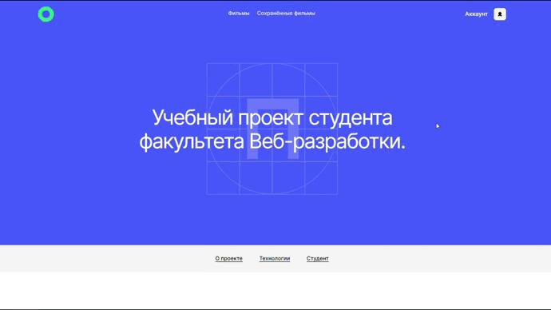
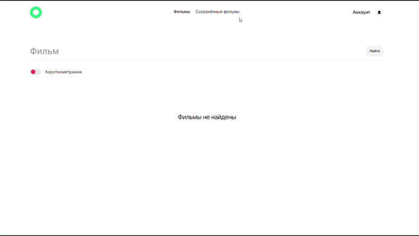

# Проект: Movies Explorer Api

## Обзор

* Ссылка на проект
* Описание проекта
* Что использовалось?
* Как запустить?

## **Ссылка на проект**

* [Фронтенд проекта на GitHub Pages](https://frantsuzovatamara.github.io/movies-explorer-frontend/)
* [Ccылка на фронтенд](https://movies.explorer.nomoredomains.monster/)
* [Ссылка на бэкенд](https://api.movies.explorer.nomoredomains.monster)

## **Описание проекта**

Api для интерактивной страницы, на которой можно:

* узнать немного обо мне, моём опыте и проектах, которые я выполняла

* регистрироваться и авторизоваться по паролю и email, выходить из профиля, искать фильмы по названию и длине, добавлять и удалять фильмы из сохранённые, по нажатию на постер фильма переходить на страничку, где можно посмотреть его трейлер, редактировать свой профиль

## **Что использовалось?**

* Node.js
* Express
* MongoDB
* Яндекс.Облако
* Postman
* Git

## **Как запустить?**

Для запуска проекта необходимо запустить movies-explorer-api на 3000 порту командой **npm run start**, далее в репозитории [movie-explorer-frontend](https://github.com/FrantsuzovaTamara/movies-explorer-frontend.git) поменять значение константы STATUS с "production" на "development" в файле [constants](./src/utils/constants.js) и запустить на 3001 порту данное приложение (ввести в терминале команду **npm run start** в ветке main). 
